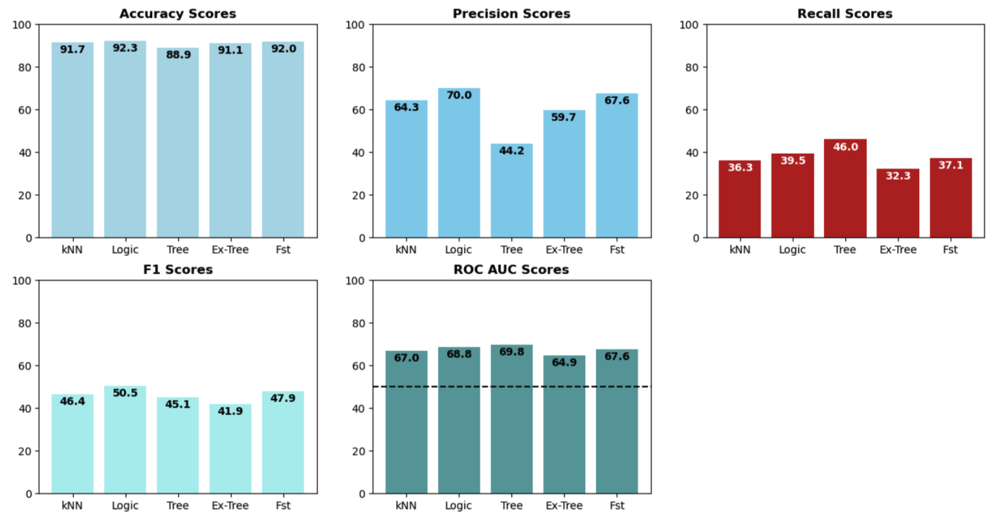
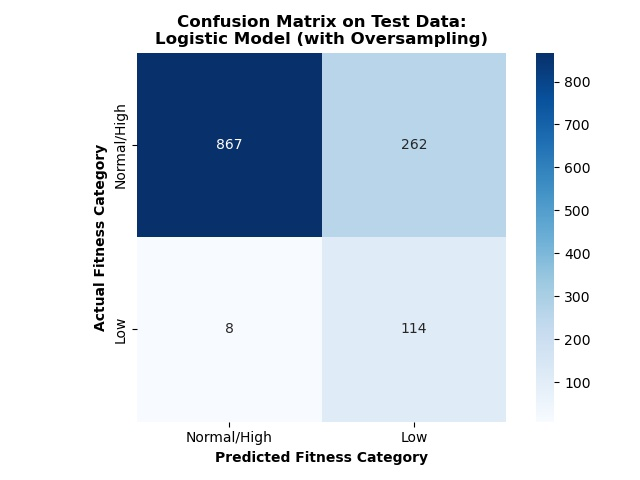

# Identifying the Appropriate Fitness Test Protocol with Machine Learning Classification Models

## Summary:
Fitness (VO2peak) is an important health marker that is assessed using an exercise test. However, there are different testing protocols, which can influence the determination of fitness (and patient safety during the test). For this project, I built and tested different classification models to determine the appropriate testing protocol for individuals, based on common health metrics. **The results indicated that a logistic regression model, involving over sampling and a lower decision threshold, was able to identify the appropriate fitness test protocol for individuals with a relatively high recall score**.

## The Rationale:
The American Heart Association [recommends]( https://pubmed.ncbi.nlm.nih.gov/27881567/) that fitness (VO2peak) be considered a clinical vital sign that is regularly assessed in the same manner as other risk factors (e.g., blood pressure, cholesterol levels). The gold-standard assessment of fitness requires individuals to perform an exercise test. However, there are many different testing protocols and no standard protocol recommendation. This is problematic as testing protocols that are too easy or too hard for an individual can lead to inaccurate assessments of fitness. Protocols that begin too hard can also pose a safety risk to participants.

Selecting the correct fitness test protocol can ensure accurate assessments of fitness and therefore improve patient risk stratification and patient care. Accordingly, **the goal of this project was to develop a classification model to assist clinicians and exercise physiologists with selecting the appropriate fitness test protocol for individuals using commonly collected health metrics**.

## The Methods/Procedures:
The data for this analysis comes from the Fitness Registry and Importance of Exercise International Database (FRIEND). This is a database consisting of fitness test results from an exercise test as well as data from pre-test health screenings. There were ~6,500 tests that had complete data required for this analysis.

The target was classification of a low absolute fitness level, defined as a peak oxygen consumption (VO2peak) <20ml/kg/min (approximately what is required to do 1.5 stages of the “Bruce” protocol, a common exercise testing protocol). Those classified as having a low absolute fitness level would then perform a “Balke” protocol (an “easier” protocol), while all others would perform the “Bruce” protocol.

Data were split into 60% training, 20% validation, and 20% testing. A variety of classification models were then created, including kNN, logistic, decision tree, extra trees, random forest, naïve Bayes, and XG Boost. Due to imbalanced groups (~10% of individuals were classified as having “low” fitness), I also explored different sampling methods (oversampling, SMOTE procedure, under-sampling), different decision thresholds, and different class weights.

A function was created to compare models by outputting numeric and visual summaries of model performance. For example:

Considering the primary concern was correctly classifying individuals with low absolute fitness, the primary metric of interest was recall. Nonetheless, other metrics were also used when selecting the best performing model.

## The Final Product/Results:
The final model chosen was a logistic model involving over-sampling and a lowered decision threshold. The features included in this model were: age, sex, height, weight, physical activity status, hypertension status, diabetes status, COPD status, cardiovascular disease status, asthma status, and beta blocker medication status. 

The confusion matrix for this model indicates that low absolute fitness level can be identified using commonly collected health metrics:

Thus, this model could be used to determine the appropriate fitness test for individuals and therefore enhance assessments of fitness, ultimately improving patient care.
